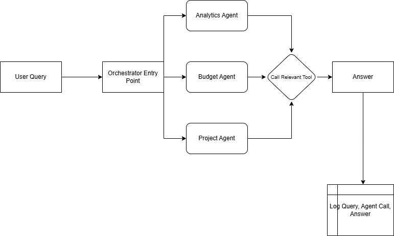

# SeedX AI Agents

## This project is a prototype implementation of a Multi-Agent AI System designed for a marketing company. The system demonstrates how multiple specialized AI agents can collaborate via an API to assist with marketing-related tasks through conversational and data-driven workflows.

## The focus is on building an extensible architecture where agents interact and share information, showcasing:

- Modular and clear agent roles

- Traceable multi-agent conversations

- Data-driven responses based on mocked datasets

## Agents
The project consists of three agents:
- Analytics Agent: Retrieves simulated analytics information about campaigns and summarizes them.
- Budget Agent: Retrieves simulated analutics information, calculates KPIs, provides a summary and gives recommendations on where to direct the budget.
- Project Agent: Retrieves simulated information about projects and their tasks, and provides a detailed summary on the status and deadlines of the tasks.

## Other Features
- Every conversation is tracked and logged in the ```logs``` directory with information like the user query, timestamp, tools used, the final response.
- The prompts used for the agents are stored in the ```config.py``` file, so that the prompts can be easily changed, and older version be stored, and the model can be changed at any time, to experiment with different models.
- Real Time Streaming: The UI supports the streaming capability provided by the LLM providers, so that the user gets near instant responses back from the system.
- Agent information: The UI has a special placeholder to let the user see which Agent was called for their query, which is useful for quick debugging and essential for finding any inconsistencies in the Agent calls.


## How to run the project
- Make sure you have a valid OPENAI_API_KEY in the .env file.
- Execute this command to install all required dependencies: ```pip install -r requirements.txt```
- Run the interactive Streamlit UI using the following command: ```streamlit run streamlit_ui.py``` and access the UI on this URL: ```http://localhost:8501```
- There is also a FastAPI backend, if a backend server is needed. Run it using the following command: ```uvicorn main:app```, and access it on this URL: ```localhost:8000```.


